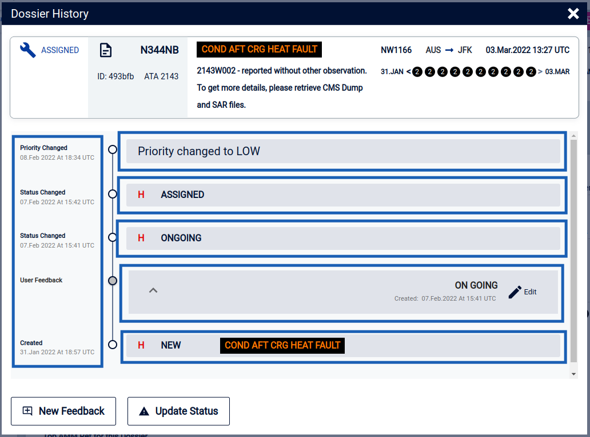

# Mid-term Dossier - Dossier History

## Use Case:
  As a user I want to be ale to access Dossier History and view the content winthin a modal.

  - Observations
  - Created
  - User Feedbacks
  - Status


## Visual:
  

## User Flow/Experience:
  1. User Access landing page and selects Mid Term
  1. Within Midterm user Selects Dossier tab
  1. User selects Dossier Card
  1. User Selects Dossier History button
  1. Dossier History Modal will be displayed
  1. If any events exist they should display nder the Dossier card.


## Pages:
  - mid-term/dossiers/dossierCardsAll
  - mid-term/dissiers/dossierDetail


## Components:
  - DossierCard
  - DossierHistoryTimeLine
  - TimeLineModal


## Acceptance Criteria:
  - `Given there is at least Dossier card to display when the user arrives at the dossier tab of mid term they should see all dossier cards and have them render. Each Dossier card shall display information and direct user to the dossier card information. After being directed the user should be able to view the Dossier history by click the button. The Dossier History will display all events tied to the specific dossier`

## Additional Details/Code Snippets:
  - n/a
  ````
  n/a
  ````
